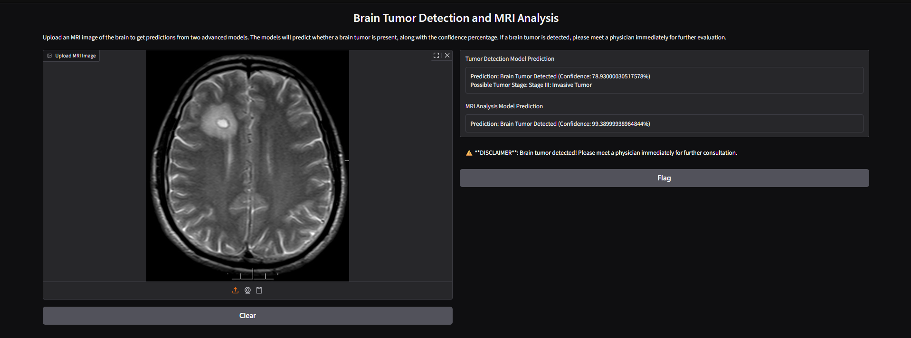

# 🧠 Brain Tumor Detection and MRI Analysis Model

A deep learning-based medical image analysis application that detects brain tumors from MRI scans using **TensorFlow** and **Keras**. The project trains convolutional neural network (CNN) models to classify MRI images as **Tumor** or **No Tumor** and provides an interactive web interface using **Gradio** for real-time predictions.

> **Disclaimer:** This project is developed for educational and research purposes only. Predictions generated by the model should not be considered a substitute for professional medical diagnosis.

---

# 📸 Application Screenshot

<p align="center">
  
</p>

---

# ✨ Features

- 🧠 Brain Tumor Detection using Deep Learning
- 🩻 MRI Image Classification
- 🤖 Convolutional Neural Network (CNN)
- 📊 Prediction Confidence Score
- 🌐 Interactive Gradio Web Interface
- ⚡ Real-time MRI Image Prediction
- 💾 Trained Model Saving (`.h5`)
- 📈 Binary Classification (Tumor / No Tumor)
- 🎯 High Accuracy Image Classification
- 🖥️ Easy-to-use Interface

---

# 🛠️ Technology Stack

### Programming Language

- Python

### Deep Learning

- TensorFlow
- Keras

### Machine Learning

- Scikit-learn

### Libraries

- NumPy
- Pillow (PIL)
- Gradio

### Development Tools

- VS Code
- Jupyter Notebook

---

# 📂 Project Structure

```text
BrainTumorDetection_MRI_Analysis_Model/
│
├── docs/
│   └── screenshots/
│       └── output.png
│
├── yes/                         # MRI images containing tumor
├── no/                          # MRI images without tumor
│
├── cnnModel (1) (1).ipynb       # Model training notebook
├── train model                  # Model training script
├── program                      # Prediction program
│
├── tumor_detection_model.h5     # Generated after training
├── mri_analysis_model.h5        # Generated after training
│
├── requirements.txt
└── README.md
```

---

# 🚀 Getting Started

## Prerequisites

Install the following before running the project:

- Python 3.11
- pip
- VS Code or Jupyter Notebook

Verify installation:

```bash
python --version
pip --version
```

---

# 📥 Installation

Clone the repository

```bash
git clone https://github.com/SuprithKumarBL20/BrainTumorDetection_MRI_Analysis_Model.git
```

Navigate to the project folder

```bash
cd BrainTumorDetection_MRI_Analysis_Model
```

Create a virtual environment

```bash
python -m venv venv
```

Activate the virtual environment

### Windows

```bash
venv\Scripts\activate
```

### Linux / macOS

```bash
source venv/bin/activate
```

Install the required packages

```bash
pip install tensorflow scikit-learn numpy pillow gradio jupyter matplotlib
```

or

```bash
pip install -r requirements.txt
```

---

# 🧠 Dataset Structure

The dataset should be organized as follows:

```text
BrainTumorDetection_MRI_Analysis_Model/
│
├── yes/
│   ├── Y1.jpg
│   ├── Y2.jpg
│   └── ...
│
└── no/
    ├── N1.jpg
    ├── N2.jpg
    └── ...
```

- **yes/** → MRI images with brain tumors
- **no/** → MRI images without brain tumors

---

# 🏋️ Training the Model

Open the project in **VS Code** or **Jupyter Notebook**.

Run:

```text
cnnModel (1) (1).ipynb
```

or

```bash
python train_model.py
```

During training, the model will display:

```text
Epoch 1/10
...
Epoch 10/10
```

After successful training:

```text
Models saved successfully!
```

The following files will be created:

```text
tumor_detection_model.h5
mri_analysis_model.h5
```

---

# ▶️ Running the Application

After training the models:

```bash
python app.py
```

Gradio will launch the application at:

```
http://127.0.0.1:7860
```

Upload an MRI image to receive the prediction.

---

# 🔍 Prediction Workflow

1. Upload an MRI image.
2. Image is resized and normalized.
3. CNN model processes the image.
4. Prediction is generated.
5. Confidence score is calculated.
6. Result is displayed as:

- ✅ No Tumor
- 🔴 Tumor Detected

---

# 📦 Project Dependencies

- TensorFlow
- Keras
- NumPy
- Pillow
- Gradio
- Scikit-learn
- Matplotlib

Install manually:

```bash
pip install tensorflow keras numpy pillow gradio scikit-learn matplotlib
```

---

# 📈 Future Enhancements

- Multi-class Brain Tumor Classification
- MRI Segmentation
- Grad-CAM Heatmap Visualization
- DICOM Image Support
- Cloud Deployment
- Patient Report Generation
- Doctor Dashboard
- Database Integration
- Improved Model Accuracy
- Model Performance Comparison

---

# 👨‍💻 Author

**Suprith Kumar B L**

- GitHub: https://github.com/SuprithKumarBL20

---

# 🤝 Contributing

Contributions are welcome.

1. Fork the repository.
2. Create a feature branch.

```bash
git checkout -b feature-name
```

3. Commit your changes.

```bash
git commit -m "Add new feature"
```

4. Push the branch.

```bash
git push origin feature-name
```

5. Open a Pull Request.

---

# 📜 License

This project is intended for educational, research, and portfolio purposes.

---

# ⭐ Support

If you found this project useful, consider giving it a ⭐ on GitHub.